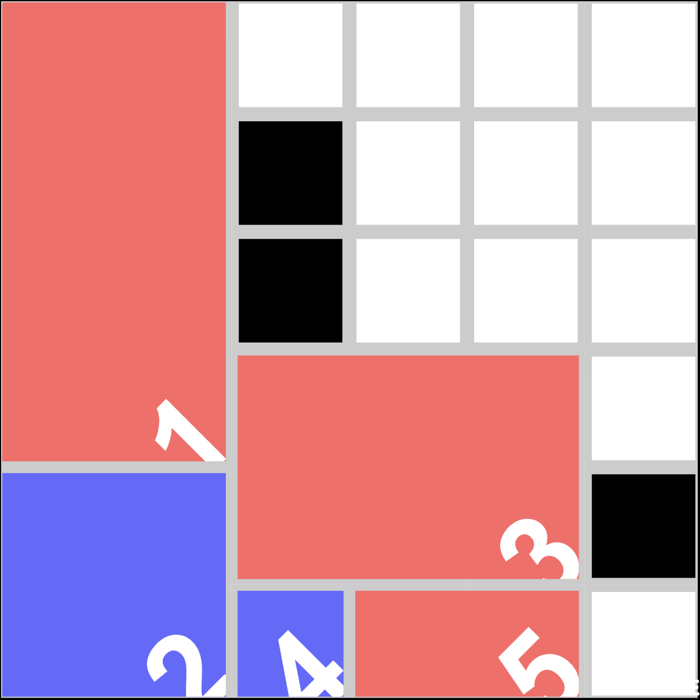

# life-tile



url: <https://oginom.github.io/life-tile>

## development

### creating app

(just for memo)

```sh
$ npx create-next-app life-tile --typescript
✔ Would you like to use ESLint with this project? …  Yes
✔ Would you like to use Tailwind CSS with this project? … Yes
✔ Would you like to use `src/` directory with this project? … Yes
✔ Use App Router (recommended)? … No
✔ Would you like to customize the default import alias? … No
```

- `webpack` と `canvas` の相性が悪いので App Router を off にしている
  - <https://github.com/Automattic/node-canvas/issues/867>
